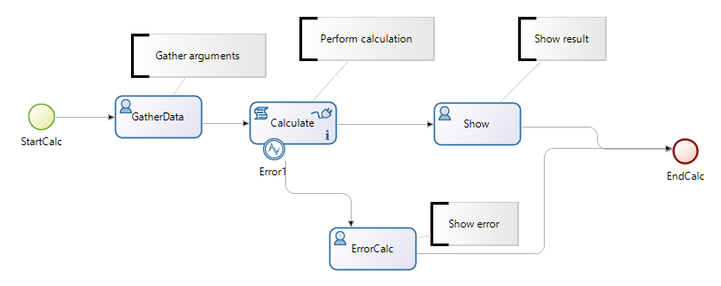

# BonitaBPMCalculator
Example implementation of simple calculator in Bonita BPM 7.2 Community Edition

Based on https://github.com/Bonitasoft-Community/vacation-management-example
and documentation

- Error handling is included (catch event -> form display)

